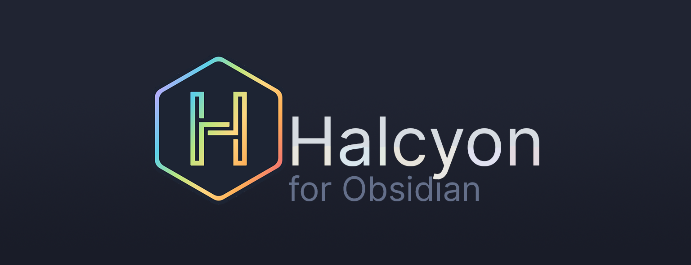

# Halcyon for Obsidian



I fell in love with the [Halcyon colour scheme](https://halcyon-theme.netlify.app/), so I decided to port it to my favourite notetaking app, [Obsidian](https://obsidian.md/). Halcyon is dark-mode only.

## Installation

You can install Halcyon through Obsidian, or manually.

### Through Obsidian (Recommended)

1. Go to `settings > appearance`.
2. Click **Manage** next to _Themes_.
3. Search for **Halcyon** (make sure you can see dark-mode themes).
4. Click **Install and use**.
5. Enjoy using my favourite theme! 🥳

### Manual

> Note: manually installed themes do not get updated automatically.
> You should prefer installing through obsidian if possible.

1. Download [the latest release](#) as ZIP file.
2. Extract the folder into your vault's `.obsidian/themes` folder.
3. Go to `settings > appearance`.
4. Select **Halcyon** from the dropdown list.
5. Enjoy using my favourite theme! 🥳

## Plugin Support

-   [Chetachi](https://github.com/chetachiezikeuzor)'s [Highlightr](obsidian://show-plugin?id=highlightr-plugin) plugin: when selecting `css-classes` as option, it will by default use the Halcyon colors for its highlights.

## Style Settings

As of version `0.0.4` there is now a basic support for style settings.
This version is still _work in progress_ and unreleased, but the code has been pushed to git.

## Known Issues

There are a few limitations that are outside of my control as theme developer. Here's a list of them.

-   Putting a [codeblock](https://help.obsidian.md/Editing+and+formatting/Basic+formatting+syntax#Code+blocks) (` ```language `) inside a [quote](https://help.obsidian.md/Editing+and+formatting/Basic+formatting+syntax#Quotes) `>` is not recognized by the underlying parser.
-   We cannot style a `dataviewjs` codeblock from the [Dataview plugin](obsidian://show-plugin?id=dataview) the same way as normal `js`, because the underlying parser doesn't recognize it as `javascript`.

_Did you find more issues? Let me know by making an [issue](https://github.com/dbarenholz/halcyon-obsidian/issues)!_

## Contributing

Feel like making Halcyon even better? Have a look at the issues with the `accepting PRs` label [here](<https://github.com/dbarenholz/halcyon-obsidian/issues?q=is%3Aissue+is%3Aopen+label%3A%22accepting+PRs%22>).
If an issue does not have that label, but it's something you want in the theme, make sure to ping me on the issue. It would be a shame if you spent your time on something that clashes with my vision for Halcyon.

To build the theme, use `npm run build`. This will do the following:

1. Run the linter `npm run lint`.
2. Compile scss to css for both the theme and publish `npm run compile`.
3. Merge in style settings and the license file `npm run merge`.

For more details, see `package.json`.


## License

This theme is released under the [MIT License](#LICENSE).

## Credits and Acknowledgments

This theme would never have seen its conception, if not for the following people:

-   [Brittany Chiang](https://brittanychiang.com/), for creating the Halcyon theme with a permissive license (MIT)!
-   Discord user [sailKite](https://github.com/sailKiteV), for surprising me with a first version of the theme out of the blue. **Thank you!**
-   Many members of the [OMG discord](https://discord.gg/obsidianmd) who have gone through many dark magics to help me fix my selectors and issues I had while creating the theme.

## Changelog

**Version 0.0.4** (work in progress):

- Add Style Settings support.
- Add Obsidian Publish support (thanks @Sigrunixia)!.

**Version 0.0.3**:

- Fix inaccurate HSL variables; this was the cause for [#4](<https://github.com/dbarenholz/halcyon-obsidian/issues/4>).
- Fix cascading issues from inaccurate HSL variables.

**Version 0.0.2**:

- Fix: Hovering headers in tables that are in a callout. See [#3](<https://github.com/dbarenholz/halcyon-obsidian/issues/3>).

**Version 0.0.1**:

- Github repository has been made public.
